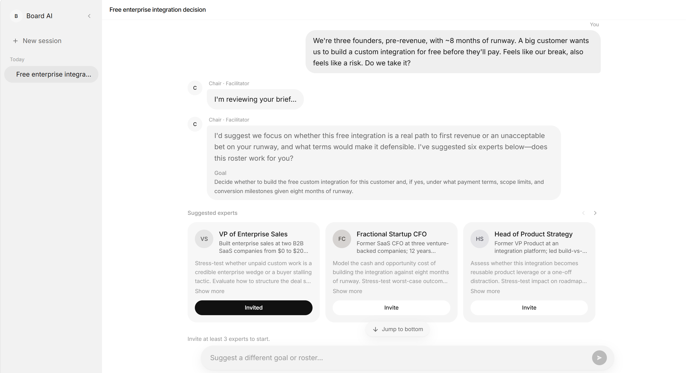

# Board AI

**A group chat for you and your AI agents**, each with a different domain background that can uniquely power your decision and insight.

You bring the question: a business call, a product bet, a strategy fork, or anything else you need to think through. A **chair** proposes who should be in the room — finance, legal, ops, market, regulation, and the rest — and you **invite** the experts you want. They speak in turn, push on each other from their own mandates, and you stay in the thread with them. When the session lands, you get a **glossary** for the jargon and an **executive brief** with takeaways, risks, experiments, and next steps — insight you couldn't get from one generalist voice.



**Live demo:** [boardai.vercel.app](https://boardai.vercel.app)

---

## How a session works

1. **Brief** — You describe the decision or question in the group chat.
2. **Kickoff** — Chair reviews the brief and proposes a meeting goal + expert roster.
3. **Invite** — You choose which domain experts join (carousel in chat).
4. **Discussion** — Experts speak in turn; you can follow up or interrupt mid-session.
5. **Briefing** — Chair synthesizes a Reveal.js executive brief + session glossary.

Sessions persist in the browser (`localStorage`) with a sidebar thread list. More board-native UI (voting, dissent lanes) is planned — the multi-agent chat loop is what ships today.

---

## For developers

**Board AI** is a Next.js app that orchestrates a **multi-agent group chat**: one chair agent, inviteable expert agents (each with a domain mandate + background), SSE streaming to the client, and structured Zod outputs for plans and briefings.


| Piece                           | Role                                                                   |
| ------------------------------- | ---------------------------------------------------------------------- |
| `POST /api/board/stream`        | Main session API — kickoff, invites, discussion, briefing (SSE)        |
| `lib/board-runner.ts`           | Session orchestration: chair plan → expert turns → briefing → glossary |
| `lib/prompts.ts`                | Chair / expert / briefing prompt templates                             |
| `lib/agent-client.ts`           | `@cursor/sdk` wrapper (local agent by default)                         |
| `hooks/useBoardStream.ts`       | Client SSE consumer + session state sync                               |
| `lib/session-store.ts`          | Per-session state in `localStorage`                                    |
| `components/BoardChatView.tsx`  | Chat thread UI (avatars, invites, composer)                            |
| `components/BriefingSlides.tsx` | In-chat Reveal.js executive brief                                      |


**Stream actions** (body on `/api/board/stream`): `start`, `brief_reply`, `approve_proposal`, `proposal_reply`, `follow_up`, `interrupt_discussion`. See [docs/prompt-flow.md](docs/prompt-flow.md) for the full prompt pipeline and event types.

**Agent runtime:** local Cursor agent by default (`CURSOR_AGENT_RUNTIME=cloud` for cloud). On Vercel serverless, `HOME` is redirected to `/tmp` in `lib/agent-client.ts` — see [docs/cursor-agent-vercel.md](docs/cursor-agent-vercel.md).

---

## Stack

- **Next.js 16** (App Router) + **React 19** + **TypeScript**
- **Cursor Agent API** (`@cursor/sdk`, model `composer-2`) for chair + expert turns
- **Reveal.js** — embedded executive brief slides in chat
- **Zod** — meeting plans, transcript, briefing JSON
- **Tailwind CSS 4**
- **react-markdown** + **remark-gfm** — message rendering

---

## Local development

**Requirements:** Node 20+, **pnpm** (this repo does not use npm/yarn).

```bash
pnpm install
```

Create `.env` in the project root:

```env
CURSOR_API_KEY=your_cursor_api_key
# optional: CURSOR_AGENT_RUNTIME=cloud
```

```bash
pnpm dev
```

Open [http://localhost:3000](http://localhost:3000). Start a brief from the home composer or open an existing session at `/c/[id]`.

### Environment


| Variable               | Required | Notes                                                 |
| ---------------------- | -------- | ----------------------------------------------------- |
| `CURSOR_API_KEY`       | Yes      | Cursor API key for agent runs                         |
| `CURSOR_AGENT_RUNTIME` | No       | `cloud` to use cloud agents; omit for local (default) |


### Scripts


| Command            | Purpose                             |
| ------------------ | ----------------------------------- |
| `pnpm dev`         | Dev server                          |
| `pnpm build`       | Production build                    |
| `pnpm start`       | Run production build                |
| `pnpm lint`        | ESLint                              |
| `pnpm smoke:board` | Smoke test against board stream API |


---

## Project layout


| Path                            | What                                           |
| ------------------------------- | ---------------------------------------------- |
| `app/(shell)/`                  | Home + session routes (`/`, `/c/[id]`)         |
| `app/api/board/stream/`         | SSE session endpoint                           |
| `app/api/board/`                | Non-stream board helpers                       |
| `components/chat/`              | Chat bubbles, composer, expert invite carousel |
| `components/shell/`             | App shell, sidebar, glossary panel             |
| `components/BriefingSlides.tsx` | Reveal.js brief deck                           |
| `lib/board-runner.ts`           | Multi-agent session runner                     |
| `lib/board-events.ts`           | SSE event + action types                       |
| `lib/prompts.ts`                | LLM prompts (chair, expert, briefing)          |
| `lib/schemas.ts`                | Zod schemas for structured agent output        |
| `lib/briefing-slide-utils.ts`   | Brief → slide chunking for Reveal              |
| `hooks/useBoardStream.ts`       | Client streaming hook                          |
| `scripts/smoke-board.ts`        | API smoke test                                 |
| `docs/`                         | Prompt flow, Vercel agent notes, README drafts |


---

## Docs

- [Prompt flow](docs/prompt-flow.md) — chair → experts → briefing → glossary (with diagrams)
- [Cursor agent on Vercel](docs/cursor-agent-vercel.md) — `HOME` / `/tmp`, Linux SDK, troubleshooting

---

## Deploy

Production: **[boardai.vercel.app](https://boardai.vercel.app)** on **Vercel**.

Set `CURSOR_API_KEY` in project environment variables. For serverless local agents, read [docs/cursor-agent-vercel.md](docs/cursor-agent-vercel.md) before first deploy (`maxDuration` on the stream route is 300s).
