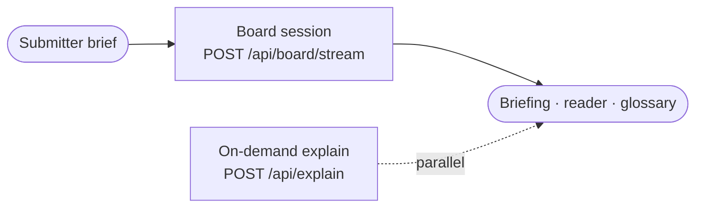
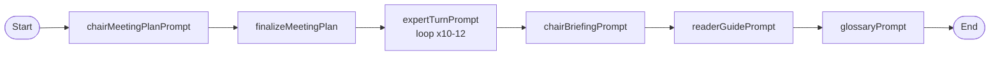
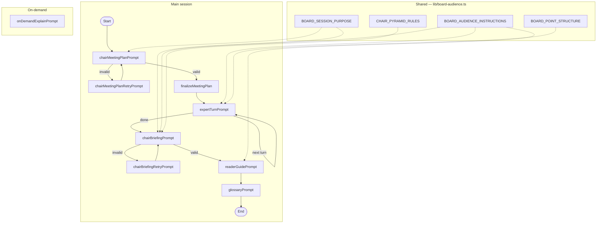

# Board AI — Prompt Flow

Board AI runs a **directed deliberation session** for any submitter brief. One HTTP request (`POST /api/board/stream`) triggers a fixed pipeline of LLM prompts: the Chair designs the session, experts debate in turn, the Chair synthesizes a briefing, then post-processing adds a reader guide and glossary. A separate on-demand path explains selected text in the UI.

**Two argument frameworks:**

| Stage | Framework | Used by |
|-------|-----------|---------|
| Expert dialogue | **PREP+C** — Point → Because → Proof → So what | `expertTurnPrompt` |
| Chair briefing | **Pyramid / BLUF** — headline first, then supporting takeaways and thesis | `chairBriefingPrompt` |

Shared rules live in `lib/board-audience.ts` and are injected into multiple prompts (shown as dashed edges in Level 3).

---

## Level 1 — Overview



**Input:** free-text brief from the user.

**Core run:** orchestrated in `lib/board-runner.ts` — plan → expert turns → briefing → reader guide → glossary. Events stream over SSE.

**Outputs:** Chair briefing JSON, per-turn reader explanations, glossary entries for UI highlighting.

**Side path:** user selects text in the UI → `onDemandExplainPrompt` → short popover copy (not part of the main stream).

---

## Level 2 — Session prompts

Each box is one `Agent.prompt` call, in order.



| Step | Prompt | Output |
|------|--------|--------|
| 1 | `chairMeetingPlanPrompt` | JSON meeting plan (roles, turn schedule, meetingGoal) |
| 2 | `finalizeMeetingPlan` | Validated plan (code, not LLM) |
| 3 | `expertTurnPrompt` | One expert message per scheduled turn |
| 4 | `chairBriefingPrompt` | JSON synthesis memo for submitter |
| 5 | `readerGuidePrompt` | JSON explanations for non-expert readers |
| 6 | `glossaryPrompt` | JSON term list with exact `match` strings |

---

## Level 3 — Detail

Retries, the expert loop, shared prompt blocks, and the on-demand path.



**Retries:** if plan or briefing JSON fails schema validation, the matching retry prompt runs once with the validation error appended.

**Expert loop:** `turnSchedule` from the plan drives 10–12 turns (configurable in `lib/board-constants.ts`). Each turn gets the growing transcript.

**Shared blocks:** four constants from `board-audience.ts` are concatenated into prompts as shown above.

---

## SSE event order

```
meeting_plan → turn (×N) → briefing → reader_guide → glossary
```

---

# Prompt content

Full prompt templates below. Placeholders shown as `{{like_this}}`. Injected shared blocks are marked **[injected]**.

---

## Shared blocks (`lib/board-audience.ts`)

### BOARD_SESSION_PURPOSE

```
This is a generic-purpose deliberative advisory board — not limited to business ideas, startups, or funding decisions.
- Infer the topic domain from the submitter's brief; do not assume commerce, an "owner," or venture framing unless the brief says so.
- The meetingGoal is the north star for every expert turn and the Chair briefing.
```

### BOARD_AUDIENCE_INSTRUCTIONS

```
Audience: smart board members from different specialties — not a specialist workshop.
- Jargon: avoid domain-specific terms; if one is essential, define it in plain language on first use (e.g. "selection bias (the sample may not represent the whole group)").
- Reasoning: make your logic audible — what you conclude, what evidence or prior speaker you rely on, and why it matters for the session goal.
- Tone: deliberative boardroom — conversational, not academic paper or consultant deck. Works for any topic domain.
```

### BOARD_POINT_STRUCTURE (PREP+C)

```
Structure each substantive message using PREP+C (in flowing prose, not labeled sections):
1. Point — one-sentence position on this turn's issue.
2. Because — why you hold that view.
3. Proof — anchor in the brief, your mandate, or a prior speaker (fact, example, named option, metric, or criterion).
4. So what — implication for the session goal (meetingGoal).
When reacting to others: briefly engage another expert by title (agree, qualify, or disagree) before or after your Point. You may add a qualifier ("I'd change my view if …").
One main point per message. Avoid opinion with no proof, proof with no link to your position, or a closing that only repeats your Point.
```

### CHAIR_PYRAMID_RULES

```
Use the Pyramid Principle / BLUF for the briefing:
- headline = BLUF: your recommendation for the submitter, with at least one filled concrete element from the debate (named option, metric, threshold, party, scope, or timeline). If the board did not agree on a key element, say so explicitly — do not leave empty slots.
- keyTakeaways = supporting arguments for why the headline holds (Pyramid middle layer).
- thesis = deeper synthesis: what to recommend now, what to defer and why, and what evidence or decision unlocks the next step — each tied to transcript content or marked "not specified in session."
Anti-patterns:
- Qualifier-only headlines that sound decisive but leave blanks (e.g. "proceed under strict caps" without stating what caps; "named loss-bearing" without naming who; "prove economics before scale" without defining the proof bar).
- Restating the headline in different words across keyTakeaways, thesis, and sevenDayPlan.
If the debate stayed abstract, put gaps in openQuestions or dissentOrUnresolved — do not invent a polished empty recommendation.
```

---

## Orchestration (`lib/board-runner.ts`)

Not an LLM prompt — documents the pipeline:

```
Request: { "brief": string }

runBoardSessionWithEvents(brief):
  1. chairMeetingPlanPrompt (+ retry on invalid JSON)
  2. expertTurnPrompt × len(turnSchedule)
  3. chairBriefingPrompt (+ retry on invalid JSON)
  4. readerGuidePrompt
  5. glossaryPrompt

SSE events: meeting_plan → turn… → briefing → reader_guide → glossary
```

---

## chairMeetingPlanPrompt (`lib/prompts.ts`)

```
You are the Chair of a deliberative advisory board. Your job in THIS message only is to DESIGN a directed session: pick the minimal expert roster and a turn-by-turn speaking schedule for the submitter's brief below.

[injected: BOARD_SESSION_PURPOSE]

Submitter brief:
---
{{userBrief}}
---

Rules:
- Pick between 3 and 6 experts. Each expert has a unique machine id `id`: lowercase_snake_case …
- Infer the topic domain from the brief …
- `title` is the expert's board seat / expert title …
- `mandate` is their detailed, non-overlapping scope for THIS brief …
- Create `turnSchedule`: ordered array of length 10–12 of `roleId` strings …
- `meetingGoal`: one sentence — a decidable or resolvable question for this brief …
- `chairNotesForFacilitator`: short private notes … enforce PREP+C …

Output ONLY valid JSON:
{
  "roles": [{ "id": "string", "title": "string", "mandate": "string" }],
  "turnSchedule": ["role_id", "..."],
  "meetingGoal": "string",
  "chairNotesForFacilitator": "optional string"
}
```

---

## chairMeetingPlanRetryPrompt (`lib/prompts.ts`)

Same as `chairMeetingPlanPrompt`, plus:

```
IMPORTANT: Your previous JSON failed validation: {{validationError}}
Return corrected JSON ONLY.
```

---

## expertTurnPrompt (`lib/prompts.ts`)

```
You are ONLY the expert: "{{expertTitle}}".
Your mandate: {{mandate}}
Session goal (meetingGoal): {{meetingGoal}}
{{optional: Chair guidance for this meeting (internal): {{chairNotes}}}}

[injected: BOARD_AUDIENCE_INSTRUCTIONS]

Other participants in this board (reference them by TITLE when relevant): {{otherExpertTitles}}

Discussion so far:
---
{{transcriptLines}}
---

Write ONE message (3 to 7 sentences). React to the most recent substantive points …

[injected: BOARD_POINT_STRUCTURE]

Do NOT speak for other roles or narrate the meeting meta. No bullet lists. Plain prose only.
```

---

## chairBriefingPrompt (`lib/prompts.ts`)

```
You are the Chair. The board session has finished. Using the submitter's original brief, the meeting plan you designed, and the full transcript, produce a synthesis memo for the submitter — not a transcript recap.

[injected: BOARD_SESSION_PURPOSE]
[injected: BOARD_AUDIENCE_INSTRUCTIONS]
[injected: CHAIR_PYRAMID_RULES]

Original brief:
---
{{userBrief}}
---

Meeting plan (JSON):
{{meetingPlanJson}}

Transcript:
---
{{transcriptText}}
---

Output ONLY valid JSON:
{
  "headline": "string — BLUF …",
  "keyTakeaways": ["string — 2 to 5 insight bullets …"],
  "thesis": "string — board conclusion after debate …",
  "keyRisks": ["string …"],
  "experiments": ["string …"],
  "sevenDayPlan": ["string — ordered next steps …"],
  "openQuestions": ["string"],
  "dissentOrUnresolved": "optional string …"
}

Field guidance + anti-patterns …
```

---

## chairBriefingRetryPrompt (`lib/prompts.ts`)

Same as `chairBriefingPrompt`, plus:

```
IMPORTANT: Previous JSON failed validation: {{validationError}}
Return corrected JSON ONLY.
```

---

## readerGuidePrompt (`lib/reader-prompts.ts`)

```
You are a reader guide for an advisory board transcript. Your ONLY job is to help a smart reader who is NOT trained in this domain understand what each expert meant and why it mattered in the debate, and the nuance behind each part of the Chair's briefing.

[injected: BOARD_AUDIENCE_INSTRUCTIONS]

Audience hint from the user's brief (use only to calibrate depth):
---
{{userBrief (truncated to 1500 chars)}}
---

Material to explain (read-only):
---
{{buildReaderBundle output: brief + plan + transcript + briefing sections}}
---

Rules:
- Output ONLY valid JSON, no markdown fences.
- For EVERY transcript turn ([turnId=N]), add one entry in `turnExplanations`.
- Write EXPLANATIONS, not summaries …
- Do NOT quote or paraphrase the experts' exact sentences …
- For EVERY Chair briefing [section=…] block, add one `briefingExplanations` entry.

JSON shape:
{"turnExplanations":[{"turnId":1,"explanation":"string"}],
 "briefingExplanations":[{"section":"thesis","explanation":"string"}, …],
 "threadFraming":"optional string"}
```

---

## glossaryPrompt (`lib/glossary-prompts.ts`)

```
You are a glossary assistant. Your ONLY job is to extract jargon, acronyms, and domain-specific multi-word phrases from the material below that a non-expert reader might not know.

Audience hint from the user's brief …
---
{{userBrief (truncated)}}
---

Full material to mine for terms (read-only):
---
{{buildGlossaryBundle output: brief + plan + transcript + briefing}}
---

Rules:
- Output ONLY valid JSON, no markdown fences.
- Return at most 60 entries.
- Each entry: "phrase", "match" (exact substring for UI highlight), "explanation" (one sentence).
- "match" must be a contiguous substring from the provided material.
- If nothing is unclear, return { "entries": [] }.

JSON shape:
{"entries":[{"phrase":"string","match":"string","explanation":"string"}]}
```

---

## onDemandExplainPrompt (`lib/explain-prompts.ts` · variant `v4-popover-ui`)

```
You explain selected text from an advisory board session for a smart reader who is NOT trained in this domain.

Audience hint from the user's brief (calibrate depth only; do not quote verbatim):
---
{{userBrief (truncated to 1200 chars)}}
---

Session context (transcript turn or briefing section):
{{meetingGoal, transcriptSnippet, briefingSnippet as available}}

Surrounding paragraph (for disambiguation):
---
{{surroundingParagraph}}
---

Selected text to explain:
---
{{selection}}
---

Rules:
- You are writing copy for a narrow UI popover (~22rem wide, small text). It must read in one glance.
- Output plain prose only. HARD LIMIT: ≤300 characters. Maximum 2 sentences.
- Use short, simple sentences (≤15 words each). One idea per sentence.
- Explain unfamiliar terms inline, then tie to this meeting in one line.
- Do NOT speak as the expert or Chair. Do NOT quote the selection.
- No preambles ("In this context…"), no closing tips, no extra vocabulary.
```

---

## Input / output (Level 1 nodes)

**Submitter brief** — `POST /api/board/stream` body `{ "brief": "…" }`. Max length in `lib/board-constants.ts`.

**Session outputs** — SSE stream: `meeting_plan`, `turn` × N, `briefing`, `reader_guide`, `glossary`.

**On-demand explain** — `POST /api/explain` with selection + context; separate from the board run.
